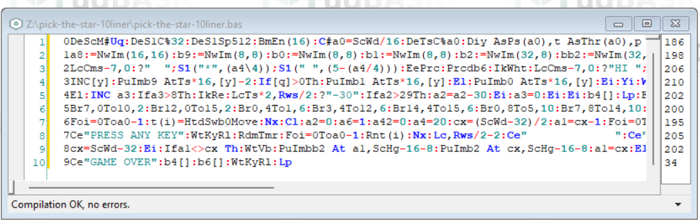

# PICK THE STAR (10 LINER)
BASIC 10 liner "pick the star"

**PICK THE STAR (10 LINER)** is a game for two players, written in [ugBASIC](https://ugbasic.iwashere.eu) and that runs on various 8-bit home computers. This game is a arcade game for one player. The player must pick mostly the stars that descend from the top of the screen, because they give to the player the higher score. In order to have a more quick binder, you can also take the circles (but you got less points). It is a self-competiting game. This game is designed for one player.

[Click here](/docs/instructions.md) to read the instructions on how to play. 

[Click here](https://spotlessmind1975.itch.io/pick-the-star-10liner) to download the executables for the various home computers:
  * **ATARI 400/800** [XEX format] ([more info](docs/instructions-atari.md))
  * **ATARI XL/XE** [XEX format] ([more info](docs/instructions-atarixl.md))
  * **Commodore 64** [PRG & D64 format] ([more info](docs/instructions-c64.md))
  * **AMSTRAD CPC 664** [DSK format] ([more info](docs/instructions-cpc.md))
  
This game joined the ["BASIC10Liner" competition 2023](https://gkanold.wixsite.com/homeputerium).

Since it joined this competition, the game itself is modest in size, and the given source code respects strong constraints on the length of each line (category: **EXTREME-256**) and it does not rely on third party libraries. The check has been done using [UGBASIC-IDE](https://spotlessmind1975.itch.io/ugbasic-ide).

For those wishing to deepen the details of its implementation, please refer to the following documents:
 *  [the source code](/docs/source.md)
 *  [the internal state of the game](/docs/game-state.md)
 