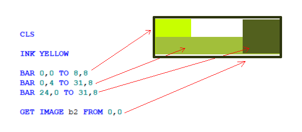
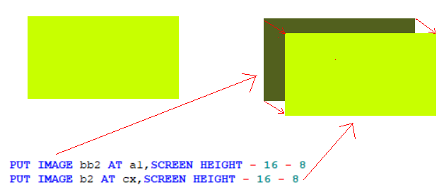
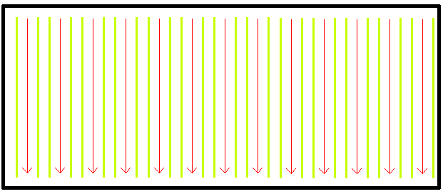
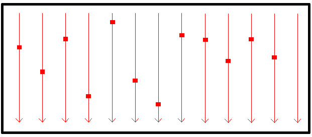
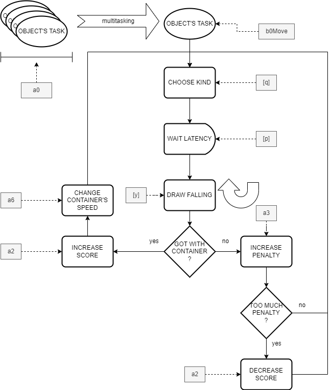

# INTERNAL GAME STATE

## PREPARING THE GRAPHICS (a8, b0, b1, b2, bb2, b9)

The BASIC 10 liner competition does not allow you to load graphic resources from the outside. Therefore, if you want to create graphics that are different from the usual, you need to find a way to incorporate these resources into the source. Having chosen to participate in the EXTREM-256 category, a minimum of space is available to design these resources. 

The basic idea is to use the screen before starting the game as a "canvas" to paint. Once painted with primitive instructions such as PLOT, DRAW, BAR, and so on, you can "capture" a snapshot of what has been drawn to consider it as a real game "sprite" (moving image) or static tile. The capture takes place with the primitive GET IMAGE.

Actually, we use these variables to store the various elements:

  * `a8` stores the tile for the wall;
  * `b0` stores the sprite for the star;
  * `b1` stores the sprite for the circle;
  * `b2` stores the sprite for the container.

Other support graphic resources are then reserved, which are not used directly to memorize images but rather to store what is found under the images. The purpose is to simulate the movement of the sprites. 

To do this, proceed in the more traditional way: erase in the previous position and draw in the next one. The deletion operation makes use of images set aside in the preparation phase.

Actually, we use these variables:

  * `b9` stores the erasing background for star and circle;
  * `bb2` stores the erasing background for the container.

## THE NUMBER OF OBJECTS (a0)

The [ugBasic](https://ugbasic.iwashere.eu) language supports a fair number of platforms, each of which has a different resolution. It is therefore natural that the number of objects that can fall is very different depending on the resolution. 

Since objects take up 8 pixels, and leave that many pixels around them, each drop lane takes up 16 pixels. It follows that, given the horizontal resolution, it is possible to calculate the number of objects that can fall simultaneously. This information is then stored in the constant `a0`, which is therefore not really a variable.

## THE POSITION OF THE OBJECTS (y)

Since there are several lanes that objects fall into, it is necessary to store at what altitude each object is. 

The goal is to maintain an independent position for each of these objects, so that a single algorithm that simulates their fall can think in terms of each individual object. This is performed by the vector `y` which contains, for each task and therefore for each object, how high it has reached.

## THE LATENCY OF OBJECTS (p)

If the objects all fell together at the same time, the game would be rather monotonous, and it would not be possible to strategize. To avoid this, each object waits a certain time before falling. This time is called latency, and is collected in vector `p`.

## THE KIND OF OBJECTS (q)

As explained in the instructions, there are two types of falling objects: shooting stars (0) and circles (1). Each object is then described by this value, which is stored in the `q` vector

## MOVING THE CONTAINER (a1, cx, cy, a6)

As explained in the preparatory section, the movement of the container is done using a rather simple algorithm. When the joystick moves to the left, the container decreases its horizontal position, while if it moves to the right, the container increases its horizontal position. The position of container is given by `cx` and `cy`. Since the increment or decrement modifies the previous position (`a1`), the simple comparison with the previous position triggers the deletion and redrawing of the container. This determines the displacement. The extent of the increase and decrease (`a6`) is, in turn, indicated by the variable x and is equal to the speed acquired.

## SCORING (a2, a3, a7)

The score is stored in the variable `a2`, and is increased or decreased according to the various situations. Note that the number of penalties is stored in the `a3` variable. When the penalties exceed the value of 8, the score decreases accordingly. Finally, the high score is stored into the `a7` variable.

## MEASURING THE TIME (a4, a42)

Time is measured in "stars". Each star represents approximately 255 wait cycles by the program.

## MULTITASKING (t)

To simplify the writing of games involving moving objects, opponents or players, [ugBasic](https://ugbasic.iwashere.eu) allows to delegate the logic of each single element of the game to some procedures. 

Since the elements move in parallel, these procedures, in turn, are performed in parallel according to a mechanism linked to the so-called multitasking. On [this page](https://retroprogramming.iwashere.eu/ugbasic:user:multitasking) and on [this page](https://retroprogramming.iwashere.eu/mt6502) you will find theoretical insights. 

What is interesting to explain, in this paragraph, is how multitasking was used to move and falling objects and to interact with the player.

The algorithm we are going to illustrate must be thought of as performed simultaneously by all the objects that are falling. We actually focus on a single object but that's just to simplify the discussion.

Each object's logic is the following. 

First of all, a kind of object must be choosen: it will be a star or a circle? We store this random value in the `q` array. In which position? The one given by the `TASK` identifier. This pseudo variable is used to distinguish a task from another. So we could use the standard BASIC syntax, `q(TASK)`. However, [ugBasic](https://ugbasic.iwashere.eu) has a shorter syntax to select a task's variable: `[q]`.

Then, we are going to wait for a random time (the latency) by decrementing the `[p]` variable.

After this pause, the program will draw the falling object, by updating the `[y]` position. The abscissa of each object is calculated by using, again, the `TASK` value with a fixed displacement  (16 pixel).

When the `[y]` value reach the container level, we can have two possibilities: it is inside the container or outside (the border is considered "outside").

If the object enters the container, the score (`a2`) will be increased by the kind of object. The container's speed too (`a6`) will be updated, as well.

If the object is outside or on the border of the container, the penalty (`a3`) will be increased by the kind of object. If too much penalty will be accumulated, the score (`a2`) will be decreased.

And this is all. In fact, the main process of the program is none other than the manager of the container, of the I/O and counts the passage of time to determine the end of the game.
