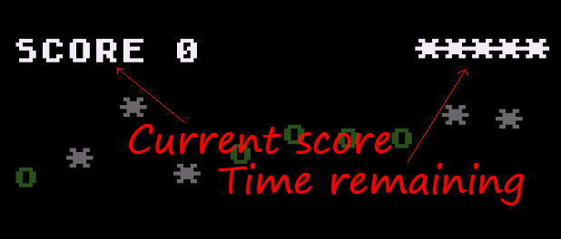
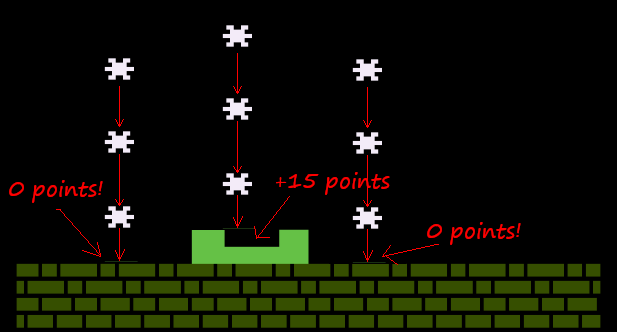
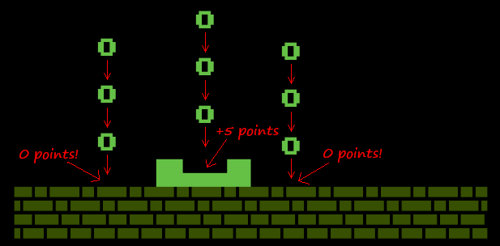
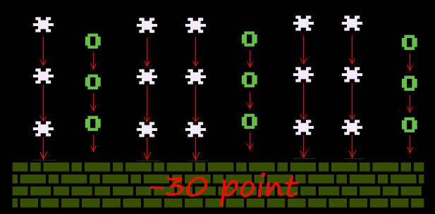

# INSTRUCTIONS

## How to play

In order to play this game you need an original's 8-bit home computer or an emulator, because the game does not work on modern computers. The game has been tried and it works correctly with following computers and emulators:

  * **ATARI 400/800** ([more info](instructions-atari.md))
  * **ATARI XL/XE** ([more info](instructions-atarixl.md))
  * **Commodore 64** ([more info](instructions-c64.md))
  * **AMSTRAD CPC 664** ([more info](instructions-cpc.md))
  
Once loaded, you can run the game by typing `RUN`.

## The aim

The aim of the game is to score as many points as possible in a given amount of time. The score you have collected so far is shown on the left of the screen, while the remaining time is shown on the right. As time passes, the stars on the right diminish. When they disappear, the game is over.

## How to increase (and decrease) score

To increase the score, you need to collect as many shooting stars as possible with the inner part of the container. If the star falls outside the container, or on the edge, no points are scored. When the container collects a star, your score increases by a whopping 15 points.

Of course, you can also increase your score by collecting circles. But the score increases by only 5 points.

However, it should be noted that if neither the circles nor the shooting stars are collected, if too many are dropped, points will be lost. In particular, for every 8 objects that touch the ground without being caught, 30 points are lost.

## How to move the container

The container can be moved left and right with the joystick (please, refer to the instructions on how to use the joystick for each computer). Its starting speed is low. When you collect a circle, the speed is increased by as much as four times. This will allow you to collect more shooting stars and circles. However, every time you collect a shooting star, the speed of the container will go back to low. 
